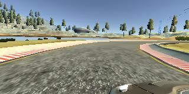

# Behaviorial Cloning

[](http://www.udacity.com/drive)


Overview
---
In this project, we will use deep neural networks and convolutional neural networks to clone driving behavior. We will train, validate and test a model using Keras. The model will output a steering angle to an autonomous vehicle.

Goals
---
- Required Files
  - Are all required files submitted?
    - Includes a model.py file, drive.py, model.h5 a writeup report and video.mp4.
- Quality of Code
  - Is the code functional?
    - The model can be used to successfully operate the simulation.
  - Is the code usable and readable?
    - Python generator used if needed
    - Code is clearly organized
    - Code is commented where needed    
- Model Architecture and Training Strategy
  - Has an appropriate model architecture been employed for the task?
    - Neural network uses convolution layers
    - Uses appropriate filter sizes
    - Nonlinearity using layers
    - Data is normalized
  - Has an attempt been made to reduce overfitting of the model?
    - Split Train/validation/test data
    - Using Dropout/other methods to reduce overfitting 
  - Have the model parameters been tuned appropriately?
    - Learning rate parameters are chosen with explanation, or an Adam optimizer is used.
  - Is the training data chosen appropriately?
    - Training data chosen to keep the car on the track
- Architecture and Training Documentation
  - Is the solution design documented?
    - Document the approach for deriving and designing a solution(model architecture fit)
  - Is the model architecture documented?
    - Document the model architecture type used, layers, size using visualizations each qualities
  - Is the creation of the training dataset and training process documented?
    - Document and provide sample how the model was trained and its dataset characteristics
- Simulation
  - Is the car able to navigate correctly on test data?
    - In Simulator No tire may leave the drivable portion of the track surface
- Track Two
  - Can the model work for car to stay on the road for **track two** as well

Approach
---
- Data: Use the simulator to collect data of good driving behavior.
- Model: Design, train and validate a model to predicts a steering angle from image data.
- Test: Use the model to drive the vehicle autonomously around the first track in the simulator. 
- Document: Summarize the results in an written report.
</br> **NOTE: The vehicle should remain on the road for an entire loop around the track.**

Result
---
 Track1                     |  Track2
 :-------------------------:|:-------------------------:
  |  

Required Files
---
- [model.py](./model.py) (script used to create and train the model)
- [drive.py](./drive.py) (script to drive the car - this file is unchanged)
- [model.h5](./model.h5) (a trained Keras model)
- [README.md](./README.md) (a report writeup markdown file)
- [video.mp4](./video.mp4) (a video recording of vehicle driving autonomously around the track for at least one full lap)

Quality of Code: Functional Code 
---
The model can be used to successfully operate the simulation.
  - [video.mp4](./video.mp4) (a video recording of vehicle driving autonomously around the track for at least one full lap)
  - [track1](./writeup-images/track1.gif) (a gif of video indicating the same)

Quality of Code: Usable and Readable Code 
---
- [Python generator is used](./model.py#L93)
- [Code is clearly organized](/model.py#L122) 
- [Code is commented where needed](/model.py#L16)  

Model Architecture and Training Strategy: Appropriate model architecture
---
[Network architecture](./model.ipynb) *is modified from* [NVIDIA CNN](https://devblogs.nvidia.com/parallelforall/deep-learning-self-driving-cars/) is used which consists of 9 layers 
- including a normalization layer
- 5 convolutional layers, and 
- 3 fully connected layers.

 **NVIDIA CNN**                     |  **USED CNN** 
 :-------------------------:|:-------------------------:
  |  

- [Neural network uses convolution layers](./model.py#L122): 
  - Feature extraction using convolution layers
- [Uses appropriate filter sizes](./model.py#L131):
  - first three convolutional layers with a 2×2 stride and a 5×5 kernel
  - next two convolution layes with a non-strided convolution with a 3×3 kernel size
- [Nonlinearity using layers](./model.py#L129):
  - Nine layers: normalization, 5 convolution and 3 funny connected.
- [Data is normalized](./model.py#L127): 
  - The first layer is lambda layer which is a convenient way to parallelize image normalization.


Model Architecture and Training Strategy: Reduce overfitting of the model
---
- [Split Train/validation/test data](./model.py#L176)
  - Train/validation/test splits have been used with **test_size=0.2**
- [Using Dropout/other methods to reduce overfitting](./model.py#L156)
  - Dropout layers used @ 0.5
  - epochs have been reduced to 3 to reduce overfitting.

 |     **Mean Squared error loss**                                                         |
 :----------------------------------------------------------------------------------------:
 ||

   
Model Architecture and Training Strategy: Tuning model parameters
---
- [Adam optimizer used because](./model.py#L199)
  - default configuration parameters(tuned appropriately) did well
  - of its per-parameter **learning rate**
  - combines the best properties of the AdaGrad and RMSProp algorithms
  - optimization algorithm that can handle sparse gradients on noisy problems

Model Architecture and Training Strategy: Appropriate training data
---
Forward and Backward [training data collected]((./sample-images)) on track one was good enough with model to keep the car on track.

#### TRACK ONE driving forward for two rounds 

|left                     |  center        |  right|
:-------------------------:|:-------------------------:|:-------------------------:
| |   |  |
  
#### TRACK ONE driving backward for one round

|left                     |  center        |  right|
:-------------------------:|:-------------------------:|:-------------------------:
| |   |  |

##### TRACK TWO driving forward for two rounds

|left                     |  center        |  right|
:-------------------------:|:-------------------------:|:-------------------------:
| |   |  |


Architecture and Training Documentation: Solution Design Documented
---
- Document the approach for deriving and designing a solution(model architecture fit)

Architecture and Training Documentation: Model Architecture Documented
---
- Document the model architecture type used, layers, size using visualizations each qualities


Architecture and Training Documentation: Creation of Training dataset and training process Documented
---
    - Document and provide sample how the model was trained and its dataset characteristics

NOTE:
* simulator

### Dependencies
This lab requires:

* [CarND Term1 Starter Kit](https://github.com/udacity/CarND-Term1-Starter-Kit)

The lab enviroment can be created with CarND Term1 Starter Kit. Click [here](https://github.com/udacity/CarND-Term1-Starter-Kit/blob/master/README.md) for the details.

The following resources can be found in this github repository:
* drive.py
* video.py
* writeup_template.md

The simulator can be downloaded from the classroom. In the classroom, we have also provided sample data that you can optionally use to help train your model.

## Details About Files In This Directory

### `drive.py`

Usage of `drive.py` requires you have saved the trained model as an h5 file, i.e. `model.h5`. See the [Keras documentation](https://keras.io/getting-started/faq/#how-can-i-save-a-keras-model) for how to create this file using the following command:
```sh
model.save(filepath)
```

Once the model has been saved, it can be used with drive.py using this command:

```sh
python drive.py model.h5
```

The above command will load the trained model and use the model to make predictions on individual images in real-time and send the predicted angle back to the server via a websocket connection.

Note: There is known local system's setting issue with replacing "," with "." when using drive.py. When this happens it can make predicted steering values clipped to max/min values. If this occurs, a known fix for this is to add "export LANG=en_US.utf8" to the bashrc file.

#### Saving a video of the autonomous agent

```sh
python drive.py model.h5 run1
```

The fourth argument, `run1`, is the directory in which to save the images seen by the agent. If the directory already exists, it'll be overwritten.

```sh
ls run1

[2017-01-09 16:10:23 EST]  12KiB 2017_01_09_21_10_23_424.jpg
[2017-01-09 16:10:23 EST]  12KiB 2017_01_09_21_10_23_451.jpg
[2017-01-09 16:10:23 EST]  12KiB 2017_01_09_21_10_23_477.jpg
[2017-01-09 16:10:23 EST]  12KiB 2017_01_09_21_10_23_528.jpg
[2017-01-09 16:10:23 EST]  12KiB 2017_01_09_21_10_23_573.jpg
[2017-01-09 16:10:23 EST]  12KiB 2017_01_09_21_10_23_618.jpg
[2017-01-09 16:10:23 EST]  12KiB 2017_01_09_21_10_23_697.jpg
[2017-01-09 16:10:23 EST]  12KiB 2017_01_09_21_10_23_723.jpg
[2017-01-09 16:10:23 EST]  12KiB 2017_01_09_21_10_23_749.jpg
[2017-01-09 16:10:23 EST]  12KiB 2017_01_09_21_10_23_817.jpg
...
```

The image file name is a timestamp of when the image was seen. This information is used by `video.py` to create a chronological video of the agent driving.

### `video.py`

```sh
python video.py run1
```

Creates a video based on images found in the `run1` directory. The name of the video will be the name of the directory followed by `'.mp4'`, so, in this case the video will be `run1.mp4`.

Optionally, one can specify the FPS (frames per second) of the video:

```sh
python video.py run1 --fps 48
```

Will run the video at 48 FPS. The default FPS is 60.

#### Why create a video

1. It's been noted the simulator might perform differently based on the hardware. So if your model drives succesfully on your machine it might not on another machine (your reviewer). Saving a video is a solid backup in case this happens.
2. You could slightly alter the code in `drive.py` and/or `video.py` to create a video of what your model sees after the image is processed (may be helpful for debugging).

## How to write a README
A well written README file can enhance your project and portfolio.  Develop your abilities to create professional README files by completing [this free course](https://www.udacity.com/course/writing-readmes--ud777).

