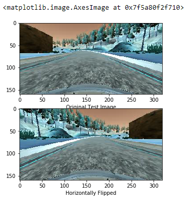

# Behaviorial Cloning

Overview
---
In this project, we will use deep neural networks and convolutional neural networks to clone driving behavior. We will train, validate and test a model using Keras. The model will output a steering angle to an autonomous vehicle.

Goals
---
- [Required Files](./README.md#required-files)
  - Are all required files submitted?
    - Includes a model.py file, drive.py, model.h5 a writeup report and video.mp4.
- [Quality of Code](./README.md#quality-of-code-functional-code)
  - Is the code functional?(./README.md#quality-of-code-functional-code)
    - The model can be used to successfully operate the simulation.
  - Is the code usable and readable?
    - Python generator used if needed
    - Code is clearly organized
    - Code is commented where needed    
- [Model Architecture and Training Strategy](./README.md#model-architecture-and-training-strategy-appropriate-model-architecture)
  - Has an appropriate model architecture been employed for the task?
    - Neural network uses convolution layers
    - Uses appropriate filter sizes
    - Nonlinearity using layers
    - Data is normalized
  - Has an attempt been made to reduce overfitting of the model?
    - Split Train/validation/test data
    - Using Dropout/other methods to reduce overfitting 
  - Have the model parameters been tuned appropriately?
    - Learning rate parameters are chosen with explanation, or an Adam optimizer is used.
  - Is the training data chosen appropriately?
    - Training data chosen to keep the car on the track
- [Architecture and Training Documentation](./README.md#architecture-and-training-documentation-solution-design-documented)
  - Is the solution design documented?
    - Document the approach for deriving and designing a solution(model architecture fit)
  - Is the model architecture documented?
    - Document the model architecture type used, layers, size using visualizations each qualities
  - Is the creation of the training dataset and training process documented?
    - Document and provide sample how the model was trained and its dataset characteristics
- [Simulation](./README.md#simulation)
  - Is the car able to navigate correctly on test data?
    - In Simulator No tire may leave the drivable portion of the track surface
- [Track Two](./README.md#track-two)
  - Can the model work for car to stay on the road for **track two** as well

Approach
---
- Data: Use the simulator to collect data of good driving behavior.
- Model: Design, train and validate a model to predicts a steering angle from image data.
- Test: Use the model to drive the vehicle autonomously around the first track in the simulator. 
- Document: Summarize the results in an written report.
  **NOTE: The vehicle should remain on the road for an entire loop around the track.**

Result
---
 Track1                     |  Track2
 :-------------------------:|:-------------------------:
  |  

Required Files
---
- [model.py](./model.py) (script used to create and train the model)
- [drive.py](./drive.py) (script to drive the car - this file is unchanged)
- [model.h5](./model.h5) (a trained Keras model)
- [README.md](./README.md) (a report writeup markdown file)
- [video.mp4](./video.mp4) (a video recording of vehicle driving autonomously around the track for at least one full lap)

Quality of Code: Functional Code 
---
The model can be used to successfully operate the simulation.
  - [video.mp4](./video.mp4) (a video recording of vehicle driving autonomously around the track for at least one full lap)
  - [track1](./writeup-images/track1.gif) (a gif of video indicating the same)

Quality of Code: Usable and Readable Code 
---
- [Python generator is used](./model.py#L93)
- [Code is clearly organized](/model.py#L122) 
- [Code is commented where needed](/model.py#L16)  

Model Architecture and Training Strategy: Appropriate model architecture
---
[Network architecture](./model.ipynb) *is modified from* [NVIDIA CNN](https://devblogs.nvidia.com/parallelforall/deep-learning-self-driving-cars/) is used which consists of 9 layers 
- including a normalization layer
- 5 convolutional layers, and 
- 3 fully connected layers.

 **NVIDIA CNN**                     |  **USED CNN** 
 :-------------------------:|:-------------------------:
  |  

- [Neural network uses convolution layers](./model.py#L122): 
  - Feature extraction using convolution layers
- [Uses appropriate filter sizes](./model.py#L131):
  - first three convolutional layers with a 2×2 stride and a 5×5 kernel
  - next two convolution layes with a non-strided convolution with a 3×3 kernel size
- [Nonlinearity using layers](./model.py#L129):
  - Nine layers: normalization, 5 convolution and 3 funny connected.
- [Data is normalized](./model.py#L127): 
  - The first layer is lambda layer which is a convenient way to parallelize image normalization.

#### Visualize model layer 1,2,3
| Convolution Featues @1,2,3 Layers |
:-------------------------:
| 

Model Architecture and Training Strategy: Reduce overfitting of the model
---
- [Split Train/validation/test data](./model.py#L176)
  - Train/validation/test splits have been used with **test_size=0.2**
- [Using Dropout/other methods to reduce overfitting](./model.py#L156)
  - Dropout layers used @ 0.5
  - epochs have been reduced to 3 to reduce overfitting.

 |     **Mean Squared error loss**                                                         |
 :----------------------------------------------------------------------------------------:
 ||

   
Model Architecture and Training Strategy: Tuning model parameters
---
- [Adam optimizer used because](./model.py#L199)
  - default configuration parameters(tuned appropriately) did well
  - of its per-parameter **learning rate**
  - combines the best properties of the AdaGrad and RMSProp algorithms
  - optimization algorithm that can handle sparse gradients on noisy problems

Model Architecture and Training Strategy: Appropriate training data
---
Forward and Backward [training data collected]((./sample-images)) on track one was good enough with model to keep the car on track.

#### TRACK ONE driving forward for two rounds 

|left                     |  center        |  right|
:-------------------------:|:-------------------------:|:-------------------------:
| |   |  |
  
#### TRACK ONE driving backward for one round

|left                     |  center        |  right|
:-------------------------:|:-------------------------:|:-------------------------:
| |   |  |

##### TRACK TWO driving forward for two rounds

|left                     |  center        |  right|
:-------------------------:|:-------------------------:|:-------------------------:
| |   |  |

#### Data Augmentation Example
|Horizontal Flip and BGR2RGB |
:-------------------------:
| 

Architecture and Training Documentation: Solution Design Documented
---
[Solution Design](./README.md#approach)
- [Data collection](./README.md#model-architecture-and-training-strategy-appropriate-training-data)
- [Model Architection](./README.md#model-architecture-and-training-strategy-appropriate-model-architecture)
- [Result](./README.md#result)

Architecture and Training Documentation: Model Architecture Documented
---
[Model Architecture](./README.md#model-architecture-and-training-strategy-appropriate-model-architecture)

Architecture and Training Documentation: Creation of Training dataset and training process Documented
---
[Training dataset creation and training process](./README.md#model-architecture-and-training-strategy-appropriate-training-data)

Simulation
---
[Video showing](./video.mp4) 
- The car is able to navigate autonomously in the simulator using the created [model](./model.h5)
- No tire left the drivable portion of the track surface(track one)
- The car did not pop up onto ledges or roll over any surfaces that would otherwise be considered unsafe(track one)

Track two
---
[Video showing](./track2.mp4)
- The car is able to navigate autonomously most of the track two in the simulator using the created [model](./model.h5)

#### Reflection on track two
- The model seems to struggle on on sharp turns on track two
- The car did better on fidling with speed, throtle parameter
- More data augmentation would help get better result on track two.

Dependencies
---
- [SIMULATOR](https://github.com/udacity/self-driving-car-sim)
- [ENVIRONMENT](https://github.com/udacity/CarND-Term1-Starter-Kit)

Conclusion
---
With every project exercise on deep/machine learning it becomes obvious and very much reiterated that it really is all about the data.
Changing model rarely has quite the impact than changing the fundaments of training data.
 **ITS ALL ABOUT DATA**
 **JUNK IN -> JUNK OUT**
